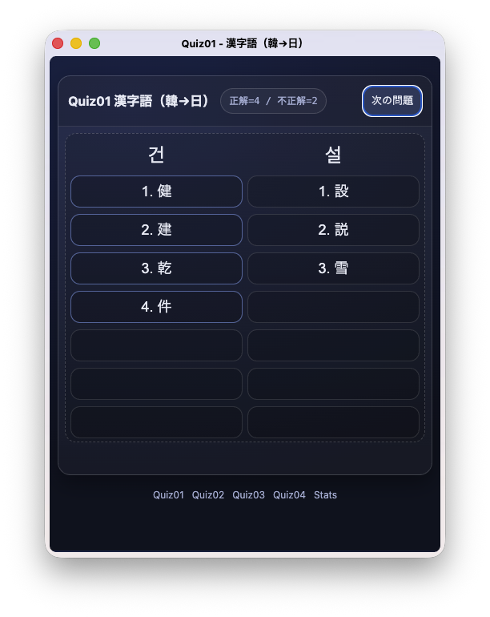
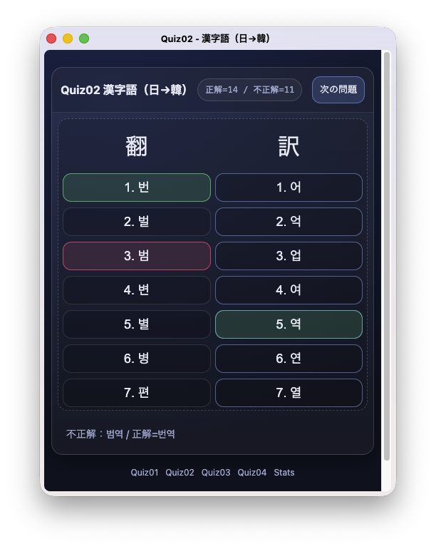
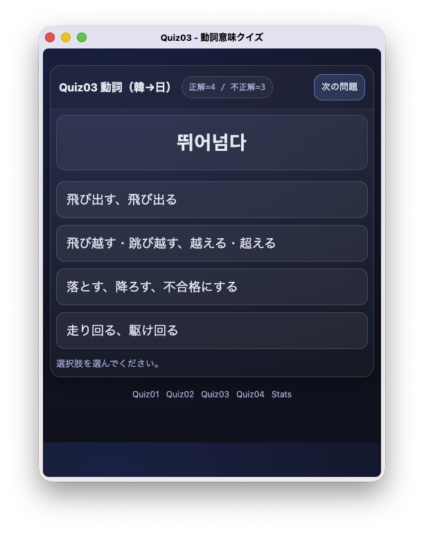
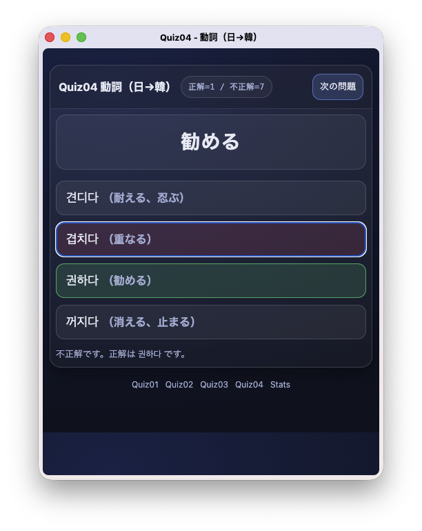

韓国語の単語ってクセがあって単純な反復練習では覚えにくいですよね。そんなクセを味方につけて、少しでも楽に覚えられるような、今までにないクイズを作ってみました。

## 漢字語と仲良くなれるクイズ

例えば「建設」を示す「건설」の１文字目の「건」は「建」だけでなく「健康」の「健」とかも示します。なので漢字語に遭遇したら、２文字も見て１文字目は何を示すかを判断しないといけなくて、まるでパズルです。

紙に書いて頭を整理しながら覚えるのが王道なんでしょうけど、アプリでプチプチやりたいですよね。そういう観点でクイズを作ってみました。

逆バージョンもあります。こちらは「翻訳」の「翻」が「번」なのか「범」なのかパッチムが混乱してたり、はたまた「번」でいいのか「펀」なのか「빤」なのか濃音・激音が混乱する人にも優しく正しい方を教えてくれる作りになってます。不正解を選んだら赤、正しい答えが緑になってるのは全ての画面で共通です。

## 動詞と仲良くなれるクイズ

単語を覚えていて漢字語と同じぐらい苦労するのが動詞ですよね。というか「ㄷ」とか「ㄸ」で始まる動詞って多すぎませんか。

というわけで似ている動詞だけ集めたクイズにしてみました。裏で前方一致とか後方一致でグループ化し、濃音・激音なども考慮して選択肢を作っています。でも、裏の仕組みは気にせず楽しんで解いてみてください。

こちらも逆バージョンがあります。どちらも正解・不正解を表示した後に、他の選択肢の意味も表示するようにしていますので、この画面をじっくり見て頭に叩き込んでください。

## もちろん進捗管理もバッチリ

画面の左上に「正解1/不正解7」のように書かれているボタンがあります。不正解が溜まってきたら、このボタンをクリックしてみてください。出題順が並び変わり、不正解だった単語から順に解くことができます。

また統計画面を用意し、１日に何問正解したかを確認することもできます。

ブラウザがあればWindows/Mac/iPhone/Androidでもインストール不要で楽しめます。Windows/PCからお使いの方はテンキーだけでサクサク解けます。

気になった方は、ぜひこちらから使ってみてください。

[https://quiz.make-and-forget.com/quiz01.html](https://quiz.make-and-forget.com/quiz01.html)

